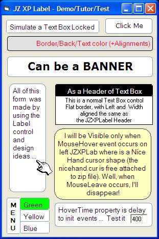



## JZ XP Label

### Description

Enhanced, easy, functional and objective, this free all-Windows XP-style was made to compose varieties and effects at app design: BorderColor/HoverTime properties, MouseHover/MouseLeave and other. Zip kit contains a nicehand.cur and app with menus, onmouse, clicks, banners, as locked Text Box, etc.
 
### More Info
 

             |
---                |---
**Submitted On**   |2005-05-19 19:51:52
**By**             |[JOZE Walter Moura](https://github.com/Planet-Source-Code/PSCIndex/blob/master/ByAuthor/joze-walter-moura.md)
**Level**          |Intermediate
**User Rating**    |4.8 (24 globes from 5 users)
**Compatibility**  |VB 6\.0
**Category**       |[Custom Controls/ Forms/  Menus](https://github.com/Planet-Source-Code/PSCIndex/blob/master/ByCategory/custom-controls-forms-menus__1-4.md)
**World**          |[Visual Basic](https://github.com/Planet-Source-Code/PSCIndex/blob/master/ByWorld/visual-basic.md)
**Archive File**   |[JZ\_XP\_Labe1889905192005\.zip](https://github.com/Planet-Source-Code/joze-walter-moura-jz-xp-label__1-60597/archive/master.zip)

